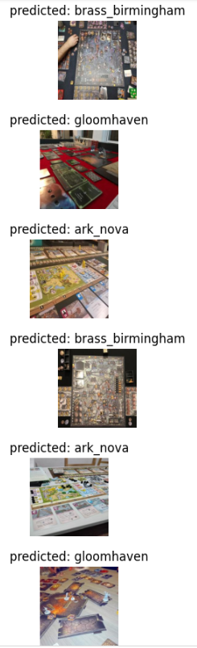

# Projeto Final - Modelos Preditivos Conexionistas

### Filipe Amado Vieira (fav@cesar.school)

|**Tipo de Projeto**|**Modelo Selecionado**|**Linguagem**|
|--|--|--|
|Classificação de Imagens| resnet34 | Python |

## Performance

O modelo treinado possui performance de **95,24%**.

### Output do bloco de treinamento

<details>
  <summary>Click to expand!</summary>
  
  ```text
Epoch 0/2
----------
Iterating through data...
train Loss: 0.4185 Acc: 0.8470
Iterating through data...
valid Loss: 0.0502 Acc: 0.9845

Epoch 1/2
----------
Iterating through data...
train Loss: 0.2108 Acc: 0.9324
Iterating through data...
valid Loss: 0.0497 Acc: 0.9806

Epoch 2/2
----------
Iterating through data...
train Loss: 0.1498 Acc: 0.9524
Iterating through data...
valid Loss: 0.0191 Acc: 0.9961

Training complete in 1m 18s
Best val Acc: 0.996124
  ```
</details>

### Evidências do treinamento


## Roboflow

[dataset de imagens preprocessadas no roboblow](https://app.roboflow.com/cesar-cg0ee/boardgames)
